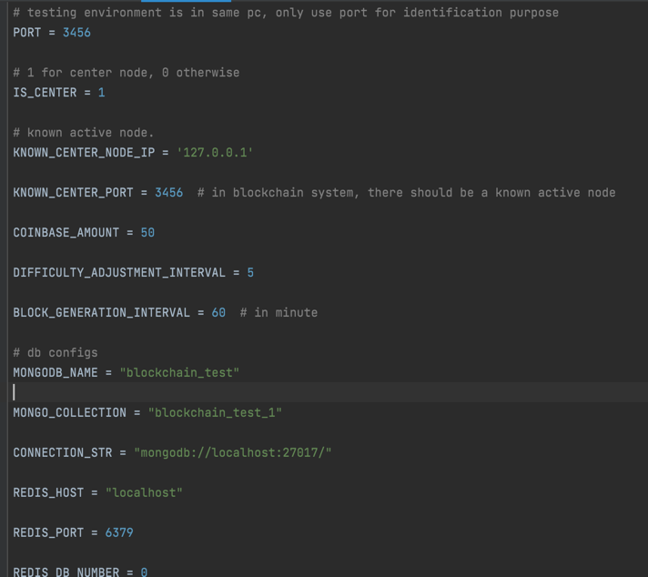

Blockchain System -> Flask, MongoDB, Redis
Please have all the imported packages ready.

Run Application -> __init__.py

Please use API testing tools to handle. (i.e. Postman, JMeter)

For most of the User Interaction APIs, the body can be leave blank.

For send transaction, the body should be in Json format with specific field:

For reset of system, please clean transaction.json to empty json array: []
Also reset mongoDB and redis content for reset, otherwise the system will run with existing data.

All the adjustable parameters are in config.py.

For different port, adjust PORT parameter.
For different database instances, adjust REDIS_DB_NUMBER and MONGO_COllECTION
Transactions.json will be under DAL, please do not touch the name.

Simple Running Workflow

For one node testing:
Start Application 1 -> call /mine, call /send_transactions, etc.
For multiple nodes testing
Start Application 1 as Persistant node -> call /join on Application 2 and other nodes